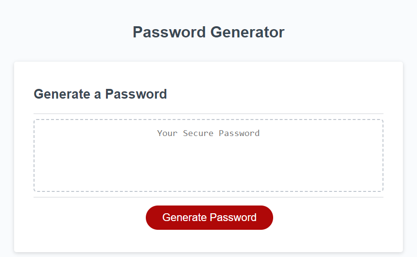
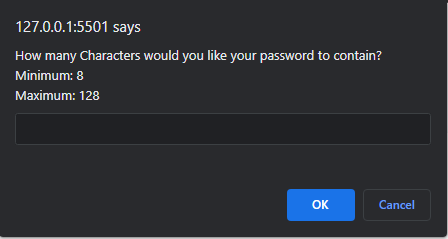
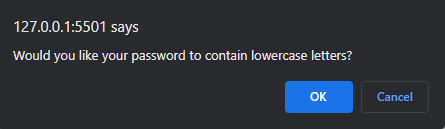
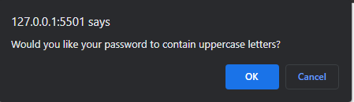
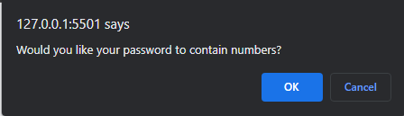
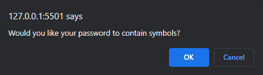
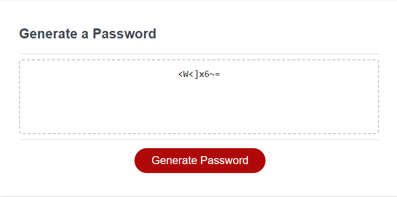

# Random Password Generator

## Description
This password generator was developed using JavaScript, HTML, and CSS. You may generate a random password that contains lowercase letters, uppercase letters, numbers, and symbols.

## Installation
N/A

## Usage

## Credits
N/A

## License

N/A

## Features

This generator will prompt you with the following questions:
* How many characters would you like your password to contain?
* Would you like your password to contain lower case letters?
* Would you like your password to contain upper case letters?
* Would you like your password to contain numbers?
* Would you like your password to contain Symbols?

After answering the series of prompts, it will then generate a password based on your answers.